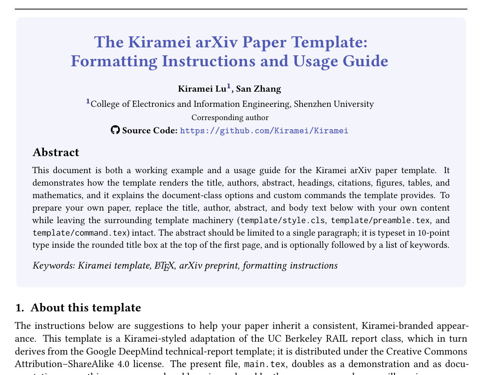
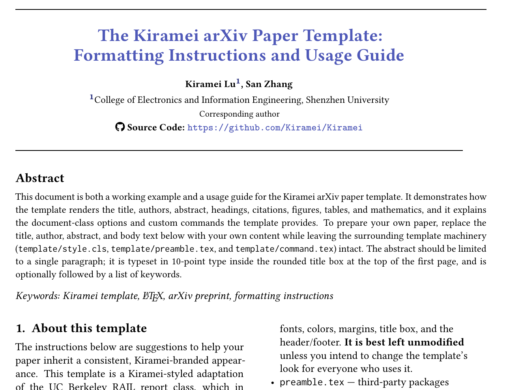

<div align="center">

# Kiramei Preprint Style

An elegant, flexible LaTeX template for arXiv preprints, technical reports, and academic manuscripts.

[](https://www.latex-project.org/)
[](#layout-gallery)
[](https://creativecommons.org/licenses/by-sa/4.0/)

</div>

Kiramei Preprint Style combines a distinctive first-page identity with practical academic typesetting. It includes coordinated serif, mathematics, and monospaced fonts; a compact title system; configurable single- and two-column layouts; bibliography support; theorem environments; tables; figures; algorithms; listings; and reusable mathematical commands.

The included [`main.tex`](main.tex) is both a working paper and a detailed usage guide. Replace its sample title, authors, abstract, and body with your own content while keeping the surrounding template structure.

## Layout gallery

<table>
  <tr>
    <th width="50%">Single-column</th>
    <th width="50%">Two-column</th>
  </tr>
  <tr>
    <td></td>
    <td></td>
  </tr>
</table>

Both previews are rendered directly from the template with XeLaTeX. Switching layouts requires only one document-class option:

```tex
% Single-column
\documentclass[11pt,letterpaper]{template/style}

% Two-column
\documentclass[11pt,letterpaper,twocolumn]{template/style}
```

## Highlights

- Single- and two-column layouts from the same source structure
- Kiramei color palette with coordinated headings, links, and title typography
- Linux Libertine text, NewTX mathematics, and Inconsolata monospaced type
- First-page title, author, affiliation, abstract, and keyword presentation
- Running title and configurable first-page footer metadata
- Built-in support for Natbib, BibTeX, booktabs, subfigures, algorithms, listings, TikZ, PGFPlots, and theorem environments
- Centralized packages in `template/preamble.tex` and reusable commands in `template/command.tex`
- A complete example document covering common academic content

## Quick start

### 1. Clone the repository

```bash
git clone https://github.com/Kiramei/kiramei-preprint.git
cd kiramei-preprint
```

### 2. Edit the paper metadata

Start in `main.tex` and replace the sample metadata:

```tex
\title{Your Paper Title}
\runningtitle{Your Short Running Title}
\keywords{keyword one, keyword two, keyword three}

\author{Your Name\\
Your Institution\\
\href{https://example.com}{\texttt{https://example.com}}
}
```

Keep the abstract before `\maketitle`; the class captures it and places it in the first-page title area.

### 3. Build the PDF

The template is tested with XeLaTeX through `latexmk`:

```bash
latexmk -xelatex -interaction=nonstopmode -halt-on-error main.tex
```

The generated paper is written to `main.pdf`. To remove auxiliary build files while keeping the PDF, run:

```bash
latexmk -c
```

A reasonably complete TeX Live installation is recommended because the example exercises a broad set of academic packages.

## Document-class options

Pass options through the `\documentclass` declaration:

| Option | Purpose |
| --- | --- |
| `10pt`, `11pt`, `12pt` | Select the base text size. |
| `letterpaper` | Use US Letter paper, the recommended submission size for arXiv. |
| `twocolumn` | Enable two-column body text; omit it for single-column layout. |
| `nonumbering` | Suppress section numbering. |
| `copyright` | Add a copyright notice to the first-page footer. |
| `internal` | Add internal-document metadata to the first-page footer. |
| `address` | Add the configured affiliation line to the first-page footer. |
| `logo` | Reserve the template's logo mode for projects that provide their own logo integration. |

Example:

```tex
\documentclass[11pt,letterpaper,twocolumn,nonumbering]{template/style}
```

## Project structure

```text
kiramei-preprint/
├── assets/
│   ├── single-column.png    # README preview
│   └── two-column.png       # README preview
├── template/
│   ├── style.cls            # Layout, colors, typography, title, header, and footer
│   ├── preamble.tex         # Third-party package configuration
│   ├── command.tex          # Mathematical shortcuts and theorem environments
│   └── abbrvnat.bst         # BibTeX bibliography style
├── main.tex                 # Example paper and full usage guide
├── main.bib                 # Example BibTeX database
├── LICENSE                  # CC BY-SA 4.0 legal code
└── README.md
```

## Customization

### Paper content

Most users only need to edit `main.tex` and `main.bib`. The example document demonstrates headings, lists, equations, theorems, figures, tables, citations, footnotes, code listings, algorithms, and colored callout boxes.

### Packages

Add or remove third-party packages in `template/preamble.tex`. Keeping package configuration separate makes `main.tex` easier to reuse as the paper grows.

### Commands and environments

Place personal mathematical shortcuts and theorem-like environments in `template/command.tex`. This keeps notation consistent across the manuscript.

### Visual identity

Colors, fonts, margins, title treatment, headers, and footers are defined in `template/style.cls`. Edit the class only when you want to change the appearance for every document using the template.

## Acknowledgments

Kiramei Preprint Style builds on the [Yale arXiv paper template](https://github.com/ngocbh/yale-paper-template), which draws from the UC Berkeley RAIL and Google DeepMind technical-report templates. Their work provided the foundation for the layout and structure adapted here.

## License

Unless a file states otherwise, the Kiramei template files are available under the [Creative Commons Attribution-ShareAlike 4.0 International License](https://creativecommons.org/licenses/by-sa/4.0/). The complete legal code is included in [`LICENSE`](LICENSE).

You may share and adapt the template, including for commercial use, provided that you give appropriate credit, indicate changes, and distribute adaptations under the same license.

Bundled third-party components retain their own licenses. In particular, `template/abbrvnat.bst` is distributed under the LaTeX Project Public License as stated in its file header.

The CC BY-SA 4.0 license applies to the template itself. Papers, figures, datasets, and other original content created with the template are **not automatically licensed under CC BY-SA 4.0**; their authors choose the terms for that content independently.
